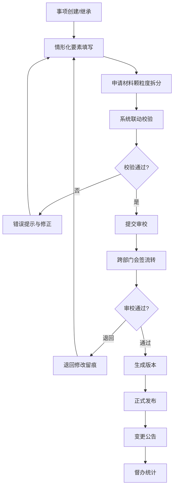

## 1. 产品概述

政务服务事项实施清单管理平台是面向省、市、县三级政务服务管理机构和部门事项管理员的 Web 应用，用于统一编制、审校和发布政务服务事项实施清单。

平台解决多层级口径不一、重复填报、审核意见分散的问题，让实施清单从起草到发布形成闭环，适合日常集中编制和年度专项梳理场景。

## 2. 核心功能

### 2.1 用户角色

| 角色 | 说明 | 核心权限 |
|------|------|----------|
| 省级管理员 | 省级政务服务管理机构人员 | 标准制定、模板维护、省级清单编制、全省督办 |
| 市级管理员 | 市级政务服务管理机构人员 | 市级清单编制、市级审校、全市督办 |
| 县级管理员 | 县级政务服务管理机构人员 | 县级清单编制、县级审校 |
| 部门事项管理员 | 各部门具体负责事项的人员 | 本部门事项编制、材料维护 |
| 审校专员 | 专门负责审校的人员 | 事项审校、会签流转 |

### 2.2 功能模块

1. **事项库模块**：事项模板维护、国家省级标准引用、事项分类管理、事项检索
2. **编制台模块**：情形化要素填写、申请材料颗粒度拆分、受理条件与办理流程联动校验、法定时限与承诺时限对比提醒
3. **审校中心模块**：跨部门会签流转、退回修改留痕、审校意见管理、同层级同事项横向比对
4. **版本发布模块**：历史版本回溯、正式发布与变更公告、上下级清单继承与差异标注
5. **督办看板模块**：编制进度统计、完成率统计、逾期预警、各部门排名
6. **知识规则模块**：常见错误规则提示、编制规范知识库、校验规则配置

### 2.3 页面详情

| 页面名称 | 模块名称 | 功能描述 |
|-----------|-------------|---------------------|
| 首页/工作台 | 督办看板 | 编制进度总览、待办事项、数据统计卡片、快捷入口 |
| 事项库列表 | 事项库 | 事项分类树、事项列表、搜索筛选、标准引用标记 |
| 事项详情 | 事项库 | 事项基本信息、标准引用情况、历史版本查看 |
| 编制台列表 | 编制台 | 我的编制事项、编制状态、进度条 |
| 事项编辑 | 编制台 | 情形化表单、材料拆分、时限对比、实时校验 |
| 审校列表 | 审校中心 | 待审校事项、会签流转、审校进度 |
| 审校详情 | 审校中心 | 事项预览、审校意见、退回操作、横向比对 |
| 版本管理 | 版本发布 | 版本列表、版本对比、发布操作 |
| 发布公告 | 版本发布 | 已发布清单、变更公告、下载导出 |
| 督办统计 | 督办看板 | 编制进度统计图表、部门排名、逾期预警 |
| 规则库 | 知识规则 | 校验规则列表、常见错误案例、编制规范 |
| 模板管理 | 事项库 | 事项模板配置、字段管理、标准导入 |

## 3. 核心流程

事项编制从模板选择或上级清单继承开始，经过情形化要素填写和材料拆分，系统实时校验后提交审校。审校过程支持跨部门会签和退回修改，审校通过后生成版本并可正式发布。发布后的清单可在督办看板中查看进度统计。

## 4. 用户界面设计

### 4.1 设计风格

采用政务风格设计，庄重严谨又不失现代感：
- **主色调**：政务蓝（#1e40af）作为主色，体现政务的权威性和专业性
- **辅助色**：红色（#dc2626）用于警示和错误，绿色（#059669）用于通过和成功，橙色（#d97706）用于警告和待处理
- **中性色**：深灰（#1f2937）用于正文，中灰（#6b7280）用于辅助文字，浅灰（#f3f4f6）用于背景
- **按钮风格**：圆角适中（6px），主按钮为政务蓝填充，悬停时加深
- **字体**：使用系统字体栈，中文优先使用微软雅黑/PingFang SC，保证政务系统的可读性和规范性
- **布局风格**：左侧导航栏 + 顶部工具栏 + 主内容区的经典后台布局，卡片式内容展示
- **图标风格**：线性图标，简洁明了，使用 Lucide 图标库

### 4.2 页面设计概述

| 页面名称 | 模块名称 | UI元素 |
|-----------|-------------|-------------|
| 工作台 | 督办看板 | 统计卡片网格、进度环形图、待办列表、快捷操作区 |
| 事项库 | 事项库 | 左侧分类树、顶部搜索栏、事项列表表格、标准标签 |
| 编制台 | 编制台 | Tab切换、分步表单、材料拆分列表、校验提示面板 |
| 审校中心 | 审校中心 | 待审校卡片、会签流程图、意见输入区、比对视图 |
| 版本发布 | 版本发布 | 版本时间线、差异对比、发布按钮、公告列表 |
| 知识规则 | 知识规则 | 规则分类、常见错误卡片、规范文档区 |

### 4.3 响应式

桌面优先设计，适配 1366px 及以上分辨率。左侧导航可收起，表格支持横向滚动，保证在中等屏幕上的可用性。

### 4.4 动效与交互

- 页面切换使用淡入淡出过渡
- 表单校验错误使用抖动动画提示
- 进度条使用平滑过渡动画
- 悬停效果使用背景色变化和轻微阴影加深
- 展开/收起使用高度过渡动画
