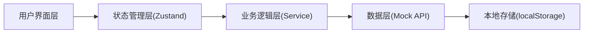
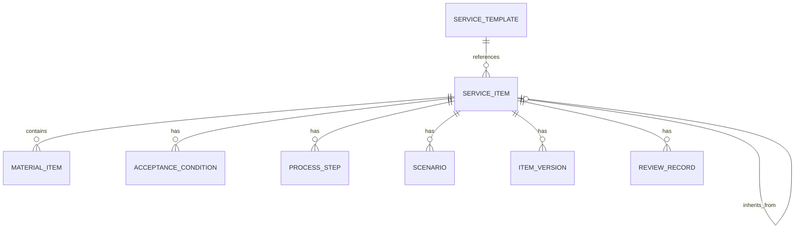

## 1. 架构设计

本项目为纯前端应用，使用 Mock 数据模拟后端，采用 React + TypeScript + Vite 技术栈，状态管理使用 Zustand，UI 样式使用 TailwindCSS，图表使用 Recharts。



## 2. 技术描述

- **前端框架**: React@18 + TypeScript
- **构建工具**: Vite@5
- **样式方案**: TailwindCSS@3
- **状态管理**: Zustand@4
- **路由管理**: React Router DOM@6
- **图标库**: Lucide React
- **图表库**: Recharts
- **UI组件**: 自定义组件 + TailwindCSS
- **数据模拟**: Mock 数据 + localStorage 持久化
- **代码规范**: ESLint + TypeScript 类型检查

## 3. 路由定义

| 路由 | 页面名称 | 模块名称 |
|-------|---------|---------|
| /dashboard | 工作台/督办看板 | 督办看板 |
| /item-library | 事项库列表 | 事项库 |
| /item-library/:id | 事项详情 | 事项库 |
| /item-library/templates | 模板管理 | 事项库 |
| /compilation | 编制台列表 | 编制台 |
| /compilation/:id | 事项编制/编辑 | 编制台 |
| /review | 审校中心列表 | 审校中心 |
| /review/:id | 审校详情 | 审校中心 |
| /version | 版本管理 | 版本发布 |
| /announcement | 发布公告 | 版本发布 |
| /supervision | 督办统计 | 督办看板 |
| /knowledge | 知识规则 | 知识规则 |

## 4. 数据模型

### 4.1 核心数据结构

```typescript
// 事项基本信息
interface ServiceItem {
  id: string;
  code: string;
  name: string;
  category: string;
  department: string;
  level: 'provincial' | 'municipal' | 'county';
  status: 'draft' | 'reviewing' | 'returned' | 'published' | 'archived';
  templateId?: string;
  parentId?: string;
  createdAt: string;
  updatedAt: string;
  createdBy: string;
}

// 事项详情
interface ServiceItemDetail extends ServiceItem {
  basicInfo: {
    serviceType: string;
    serviceObject: string;
    legalBasis: string[];
    handlingBasis: string;
  };
  conditions: AcceptanceCondition[];
  materials: MaterialItem[];
  process: ProcessStep[];
  timeLimit: {
    legalDays: number;
    promiseDays: number;
    remark: string;
  };
  fee: {
    charge: boolean;
    standard: string;
    basis: string;
  };
  scenarios: Scenario[];
}

// 受理条件
interface AcceptanceCondition {
  id: string;
  content: string;
  sort: number;
  required: boolean;
}

// 申请材料
interface MaterialItem {
  id: string;
  name: string;
  type: 'original' | 'copy' | 'both';
  count: number;
  necessity: 'required' | 'optional' | 'conditional';
  form: 'paper' | 'electronic' | 'both';
  remark: string;
  source: string;
  isBlankForm: boolean;
  isSample: boolean;
}

// 办理流程
interface ProcessStep {
  id: string;
  step: number;
  name: string;
  handler: string;
  duration: number;
  description: string;
  conditions: string[];
}

// 情形
interface Scenario {
  id: string;
  name: string;
  conditions: string[];
  materials: string[];
  process: string[];
}

// 版本
interface ItemVersion {
  id: string;
  itemId: string;
  version: string;
  status: 'draft' | 'published' | 'superseded';
  publishDate?: string;
  changes: string[];
  createdBy: string;
  createdAt: string;
  snapshot: ServiceItemDetail;
}

// 审校记录
interface ReviewRecord {
  id: string;
  itemId: string;
  versionId: string;
  type: 'review' | 'sign';
  status: 'pending' | 'approved' | 'rejected';
  reviewer: string;
  department: string;
  opinion: string;
  createdAt: string;
}

// 编制进度
interface CompilationProgress {
  department: string;
  total: number;
  completed: number;
  drafting: number;
  reviewing: number;
  overdue: number;
  deadline: string;
}
```

### 4.2 数据关系图



## 5. 项目结构

```
src/
├── components/          # 通用组件
│   ├── Layout/         # 布局组件
│   ├── Table/          # 表格组件
│   ├── Form/           # 表单组件
│   ├── Status/         # 状态标签组件
│   ├── Modal/          # 弹窗组件
│   └── Chart/          # 图表组件
├── pages/              # 页面组件
│   ├── Dashboard/      # 工作台
│   ├── ItemLibrary/    # 事项库
│   ├── Compilation/    # 编制台
│   ├── Review/         # 审校中心
│   ├── Version/        # 版本发布
│   ├── Supervision/    # 督办看板
│   └── Knowledge/      # 知识规则
├── store/              # Zustand状态管理
│   ├── itemStore.ts    # 事项状态
│   ├── userStore.ts    # 用户状态
│   └── reviewStore.ts  # 审校状态
├── data/               # Mock数据
│   ├── items.ts        # 事项数据
│   ├── templates.ts    # 模板数据
│   └── knowledge.ts    # 知识规则数据
├── utils/              # 工具函数
│   ├── validator.ts    # 校验规则
│   ├── format.ts       # 格式化函数
│   └── storage.ts      # 本地存储
├── types/              # TypeScript类型
│   └── index.ts
├── App.tsx
├── main.tsx
└── index.css
```

## 6. 核心功能实现思路

### 6.1 事项模板与标准引用
- 使用模板创建事项时，复制模板内容作为初始值
- 标准引用字段标记来源层级（国家/省/市）
- 引用字段锁定不可随意修改，支持"差异化"标注

### 6.2 情形化要素填写
- 情形条件驱动材料和流程的显示/隐藏
- 基于选择的情形组合自动过滤对应的要素
- 支持多情形组合逻辑（与/或）

### 6.3 申请材料颗粒度拆分
- 材料可拆分子项（如原件/复印件、纸质/电子版）
- 支持材料复用（同一材料可在多事项中引用）
- 材料来源标记（申请人自备/部门核发/系统共享）

### 6.4 联动校验
- 受理条件与办理流程步骤关联校验
- 法定时限与承诺时限自动对比，承诺时限不可超过法定时限
- 实时校验并在表单旁显示错误提示

### 6.5 横向比对与差异标注
- 同层级同部门事项横向对比表格
- 上下级事项差异高亮显示
- 支持差异导出和差异说明填写

### 6.6 会签流转
- 审校流程配置，支持串行/并行会签
- 流转记录留痕，每个节点的处理意见和时间
- 退回时需填写退回原因

### 6.7 版本管理
- 每次提交审校通过后生成新版本
- 版本间对比，高亮差异
- 历史版本回溯查看

### 6.8 督办统计
- 各部门编制进度统计
- 编制完成率排名
- 逾期事项预警
- 多维度统计图表
